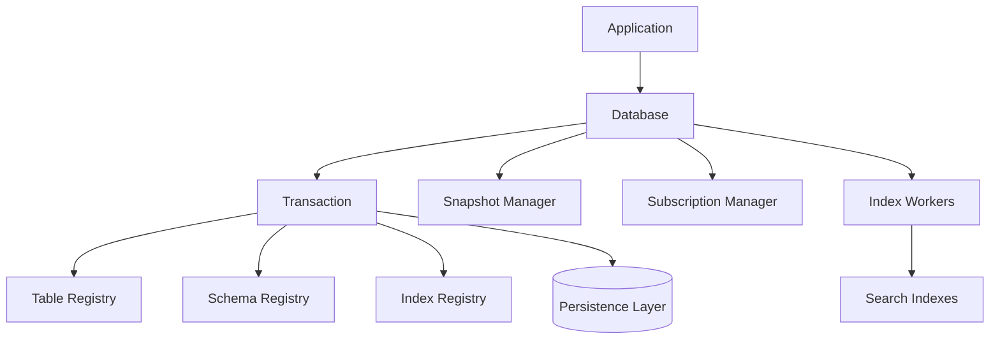

The database engine is the heart of Convex's data management, providing ACID transactions, snapshot isolation, reactive subscriptions, and automatic index maintenance.

## Overview

Path: `crates/database/`

The database crate implements:

- Transactional ACID database with snapshot isolation
- Table and schema management
- Index coordination and query optimization
- Reactive subscription tracking
- Read and write set management
- Strong consistency guarantees

## Architecture



## Core components

### Database struct

Main database interface:

```rust
pub struct Database<RT: Runtime> {
    /// Runtime for async operations
    runtime: RT,
    
    /// Persistence layer
    persistence: Arc<dyn Persistence>,
    
    /// Snapshot manager for MVCC
    snapshot_manager: SnapshotManager,
    
    /// Subscription tracking
    subscription_manager: SubscriptionManager,
    
    /// Index workers
    index_workers: Arc<IndexWorkers>,
    
    /// Table registry
    tables: Arc<RwLock<TableRegistry>>,
    
    /// Schema registry
    schemas: Arc<RwLock<SchemaRegistry>>,
}

impl<RT: Runtime> Database<RT> {
    pub async fn new(
        runtime: RT,
        persistence: Arc<dyn Persistence>,
    ) -> Result<Self> {
        // Initialize components
        let snapshot_manager = SnapshotManager::new();
        let subscription_manager = SubscriptionManager::new();
        let tables = Arc::new(RwLock::new(TableRegistry::new()));
        let schemas = Arc::new(RwLock::new(SchemaRegistry::new()));
        
        // Start index workers
        let index_workers = Arc::new(IndexWorkers::start(
            runtime.clone(),
            persistence.clone(),
        ));
        
        Ok(Self {
            runtime,
            persistence,
            snapshot_manager,
            subscription_manager,
            index_workers,
            tables,
            schemas,
        })
    }
}
```

### Transaction

Path: `crates/database/src/transaction.rs`

Transactional interface:

```rust
pub struct Transaction<RT: Runtime> {
    /// Transaction ID
    id: TransactionId,
    
    /// Begin timestamp (snapshot)
    begin_ts: Timestamp,
    
    /// Commit timestamp (assigned at commit)
    commit_ts: Option<Timestamp>,
    
    /// Read set for conflict detection
    reads: ReadSet,
    
    /// Write set (buffered writes)
    writes: WriteSet,
    
    /// Table registry snapshot
    tables: TableRegistry,
    
    /// Schema registry snapshot
    schemas: SchemaRegistry,
    
    /// Index registry snapshot
    indexes: IndexRegistry,
}

impl<RT: Runtime> Transaction<RT> {
    /// Read a document by ID
    pub async fn get(
        &mut self,
        id: DocumentId,
    ) -> Result<Option<ResolvedDocument>> {
        // Track read for subscriptions
        self.reads.insert(id);
        
        // Check write set first
        if let Some(doc) = self.writes.get(&id) {
            return Ok(Some(doc.clone()));
        }
        
        // Read from persistence at snapshot
        let doc = self.persistence
            .get_at_timestamp(id, self.begin_ts)
            .await?;
        
        Ok(doc)
    }
    
    /// Insert a new document
    pub fn insert(
        &mut self,
        table: TableName,
        document: ConvexObject,
    ) -> Result<DocumentId> {
        // Validate against schema
        self.schemas.validate(table, &document)?;
        
        // Generate ID
        let id = self.id_generator.next_id(table)?;
        
        // Add to write set
        self.writes.insert(id, document);
        
        Ok(id)
    }
    
    /// Update a document
    pub fn patch(
        &mut self,
        id: DocumentId,
        patches: ConvexObject,
    ) -> Result<()> {
        // Get current version
        let mut doc = self.get(id).await?
            .ok_or_else(|| anyhow!("Document not found"))?;
        
        // Apply patches
        for (field, value) in patches {
            doc.insert(field, value);
        }
        
        // Validate
        self.schemas.validate(id.table(), &doc)?;
        
        // Update write set
        self.writes.update(id, doc);
        
        Ok(())
    }
    
    /// Delete a document
    pub fn delete(&mut self, id: DocumentId) -> Result<()> {
        // Mark as deleted in write set
        self.writes.delete(id);
        Ok(())
    }
    
    /// Query a table
    pub fn query(
        &mut self,
        table: TableName,
    ) -> Query<RT> {
        Query::new(self, table)
    }
}
```

## Transaction lifecycle

### Begin transaction

```rust
impl<RT: Runtime> Database<RT> {
    pub async fn begin(&self) -> Result<Transaction<RT>> {
        // Acquire transaction ID
        let id = self.id_generator.next_transaction_id();
        
        // Get current timestamp (snapshot point)
        let begin_ts = self.snapshot_manager.current_timestamp();
        
        // Create transaction with snapshot of metadata
        let tx = Transaction {
            id,
            begin_ts,
            commit_ts: None,
            reads: ReadSet::new(),
            writes: WriteSet::new(),
            tables: self.tables.read().clone(),
            schemas: self.schemas.read().clone(),
            indexes: self.indexes.read().clone(),
        };
        
        Ok(tx)
    }
}
```

### Commit transaction

```rust
impl<RT: Runtime> Transaction<RT> {
    pub async fn commit(mut self) -> Result<CommitResult> {
        // Validate writes
        self.validate_writes()?;
        
        // Detect conflicts
        self.check_conflicts().await?;
        
        // Acquire commit timestamp
        let commit_ts = self.snapshot_manager.next_timestamp();
        self.commit_ts = Some(commit_ts);
        
        // Write to persistence
        self.persistence.write_batch(
            &self.writes,
            commit_ts,
        ).await?;
        
        // Update indexes asynchronously
        self.index_workers.schedule_updates(
            &self.writes,
            commit_ts,
        );
        
        // Notify subscribers
        self.subscription_manager.notify(
            &self.writes,
            commit_ts,
        );
        
        Ok(CommitResult {
            timestamp: commit_ts,
            writes: self.writes.len(),
        })
    }
}
```

### Conflict detection

```rust
impl<RT: Runtime> Transaction<RT> {
    async fn check_conflicts(&self) -> Result<()> {
        // Check if any read documents were modified
        for doc_id in &self.reads {
            let modified = self.persistence
                .was_modified_since(doc_id, self.begin_ts)
                .await?;
            
            if modified {
                return Err(anyhow!("Transaction conflict: document {} was modified", doc_id));
            }
        }
        
        Ok(())
    }
}
```

## Query execution

### Query builder

Path: `crates/database/src/query.rs`

```rust
pub struct Query<RT: Runtime> {
    tx: &mut Transaction<RT>,
    table: TableName,
    index: Option<IndexName>,
    filter: Option<Filter>,
    limit: Option<usize>,
    order: Option<Order>,
}

impl<RT: Runtime> Query<RT> {
    /// Specify index to use
    pub fn with_index(mut self, index: IndexName) -> Self {
        self.index = Some(index);
        self
    }
    
    /// Add filter
    pub fn filter(mut self, filter: Filter) -> Self {
        self.filter = Some(filter);
        self
    }
    
    /// Limit results
    pub fn take(mut self, limit: usize) -> Self {
        self.limit = Some(limit);
        self
    }
    
    /// Collect all results
    pub async fn collect(self) -> Result<Vec<ResolvedDocument>> {
        let mut results = Vec::new();
        
        // Choose index
        let index = self.choose_index()?;
        
        // Scan index
        let mut cursor = index.scan(self.filter.as_ref())?;
        
        while let Some(doc_id) = cursor.next().await? {
            // Track read
            self.tx.reads.insert(doc_id);
            
            // Get document
            let doc = self.tx.get(doc_id).await?;
            
            // Apply filter
            if let Some(doc) = doc {
                if self.matches_filter(&doc) {
                    results.push(doc);
                    
                    // Check limit
                    if let Some(limit) = self.limit {
                        if results.len() >= limit {
                            break;
                        }
                    }
                }
            }
        }
        
        Ok(results)
    }
    
    /// Stream results
    pub fn stream(self) -> impl Stream<Item = Result<ResolvedDocument>> {
        // Return async stream of documents
        // ...
    }
}
```

### Index selection

```rust
impl<RT: Runtime> Query<RT> {
    fn choose_index(&self) -> Result<&Index> {
        // If index specified, use it
        if let Some(index_name) = &self.index {
            return self.tx.indexes.get(index_name)
                .ok_or_else(|| anyhow!("Index not found: {}", index_name));
        }
        
        // Otherwise, find best index for filter
        if let Some(filter) = &self.filter {
            if let Some(index) = self.tx.indexes.find_best_index(filter) {
                return Ok(index);
            }
        }
        
        // Fall back to table scan (creation index)
        Ok(self.tx.indexes.get_creation_index(self.table)?)
    }
}
```

## Table registry

Path: `crates/database/src/table_registry.rs`

```rust
pub struct TableRegistry {
    tables: BTreeMap<TableName, TableMetadata>,
    table_mapping: TableMapping,
}

pub struct TableMetadata {
    name: TableName,
    id: TableId,
    created_at: Timestamp,
    document_count: u64,
}

impl TableRegistry {
    pub fn create_table(&mut self, name: TableName) -> Result<TableId> {
        // Check if table exists
        if self.tables.contains_key(&name) {
            return Err(anyhow!("Table already exists: {}", name));
        }
        
        // Generate table ID
        let id = self.table_mapping.next_id();
        
        // Create metadata
        let metadata = TableMetadata {
            name: name.clone(),
            id,
            created_at: Timestamp::now(),
            document_count: 0,
        };
        
        self.tables.insert(name, metadata);
        Ok(id)
    }
    
    pub fn get_table(&self, name: &TableName) -> Option<&TableMetadata> {
        self.tables.get(name)
    }
}
```

## Schema registry

Path: `crates/database/src/schema_registry.rs`

```rust
pub struct SchemaRegistry {
    schemas: BTreeMap<TableName, TableSchema>,
}

pub struct TableSchema {
    fields: BTreeMap<FieldName, FieldValidator>,
    indexes: Vec<IndexDefinition>,
}

impl SchemaRegistry {
    pub fn validate(
        &self,
        table: &TableName,
        document: &ConvexObject,
    ) -> Result<()> {
        let schema = self.schemas.get(table)
            .ok_or_else(|| anyhow!("No schema for table: {}", table))?;
        
        // Validate each field
        for (field, value) in document.iter() {
            if let Some(validator) = schema.fields.get(field) {
                validator.validate(value)?;
            }
        }
        
        Ok(())
    }
}
```

## Subscription management

Path: `crates/database/src/subscription.rs`

```rust
pub struct SubscriptionManager {
    subscriptions: Arc<RwLock<BTreeMap<SubscriptionId, Subscription>>>,
}

pub struct Subscription {
    id: SubscriptionId,
    query_set: ReadSet,
    sender: mpsc::Sender<Update>,
}

impl SubscriptionManager {
    pub fn register(
        &self,
        read_set: ReadSet,
    ) -> (SubscriptionId, mpsc::Receiver<Update>) {
        let id = SubscriptionId::new();
        let (tx, rx) = mpsc::channel(100);
        
        let subscription = Subscription {
            id,
            query_set: read_set,
            sender: tx,
        };
        
        self.subscriptions.write().insert(id, subscription);
        (id, rx)
    }
    
    pub fn notify(
        &self,
        writes: &WriteSet,
        timestamp: Timestamp,
    ) {
        let subscriptions = self.subscriptions.read();
        
        for subscription in subscriptions.values() {
            // Check if write affects this subscription
            if writes.intersects(&subscription.query_set) {
                let update = Update {
                    timestamp,
                    changes: writes.clone(),
                };
                
                // Send update (non-blocking)
                subscription.sender.try_send(update).ok();
            }
        }
    }
}
```

## Index workers

Path: `crates/database/src/database_index_workers.rs`

```rust
pub struct IndexWorkers {
    workers: Vec<IndexWorker>,
}

pub struct IndexWorker {
    update_queue: mpsc::Receiver<IndexUpdate>,
    index_writer: IndexWriter,
}

impl IndexWorker {
    pub async fn run(mut self) -> Result<()> {
        while let Some(update) = self.update_queue.recv().await {
            match update {
                IndexUpdate::Document { id, change } => {
                    self.update_indexes(id, change).await?;
                }
                IndexUpdate::Backfill { index_id } => {
                    self.backfill_index(index_id).await?;
                }
            }
        }
        Ok(())
    }
    
    async fn update_indexes(
        &mut self,
        doc_id: DocumentId,
        change: DocumentChange,
    ) -> Result<()> {
        match change {
            DocumentChange::Insert(doc) => {
                self.index_writer.insert(doc_id, &doc).await?;
            }
            DocumentChange::Update { old, new } => {
                self.index_writer.update(doc_id, &old, &new).await?;
            }
            DocumentChange::Delete(doc) => {
                self.index_writer.delete(doc_id, &doc).await?;
            }
        }
        Ok(())
    }
}
```

## Read and write sets

Path: `crates/database/src/reads.rs` and `crates/database/src/writes.rs`

```rust
pub struct ReadSet {
    /// Documents read during transaction
    documents: BTreeSet<DocumentId>,
    
    /// Tables scanned
    tables: BTreeSet<TableName>,
    
    /// Index ranges scanned
    index_ranges: Vec<IndexRange>,
}

pub struct WriteSet {
    /// Documents inserted
    inserts: BTreeMap<DocumentId, ConvexObject>,
    
    /// Documents updated
    updates: BTreeMap<DocumentId, ConvexObject>,
    
    /// Documents deleted
    deletes: BTreeSet<DocumentId>,
}

impl ReadSet {
    pub fn intersects(&self, writes: &WriteSet) -> bool {
        // Check if any written documents were read
        for doc_id in &self.documents {
            if writes.contains(doc_id) {
                return true;
            }
        }
        
        // Check if any scanned tables were written
        for table in &self.tables {
            if writes.affects_table(table) {
                return true;
            }
        }
        
        false
    }
}
```

## Testing

### Transaction tests

```rust
#[tokio::test]
async fn test_transaction_isolation() {
    let db = Database::new_test().await;
    
    // Start two transactions
    let mut tx1 = db.begin().await.unwrap();
    let mut tx2 = db.begin().await.unwrap();
    
    // Insert in tx1
    let id = tx1.insert("tasks", doc).unwrap();
    
    // tx2 should not see it
    assert!(tx2.get(id).await.unwrap().is_none());
    
    // Commit tx1
    tx1.commit().await.unwrap();
    
    // Start tx3 - should see the insert
    let mut tx3 = db.begin().await.unwrap();
    assert!(tx3.get(id).await.unwrap().is_some());
}
```

## Next steps

- [Indexing system](/architecture/indexing) - Index implementation
- [Data persistence layer](/architecture/persistence) - Storage backend
- [Function runner component](/architecture/components/function-runner) - UDF execution
- [Rust backend architecture](/architecture/rust-backend) - Overall architecture
