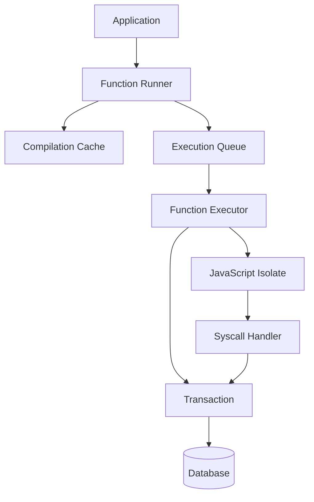

The function runner orchestrates the execution of user-defined functions (UDFs) including queries, mutations, and actions. It manages function compilation, caching, transaction coordination, and result collection.

## Overview

Path: `crates/function_runner/`

The function runner provides:

- Function execution orchestration
- Compilation and caching
- Transaction lifecycle management
- Isolate coordination
- Result streaming
- Error handling and retry logic

## Architecture



## Function types

### Query functions

Read-only database access:

```typescript
export const listTasks = query(async (ctx) => {
  return await ctx.db.query("tasks").collect();
});
```

Properties:
- Read-only (no mutations)
- Automatic subscriptions
- Cacheable
- Fast execution

### Mutation functions

Read-write database access:

```typescript
export const createTask = mutation(async (ctx, args) => {
  await ctx.db.insert("tasks", {
    title: args.title,
    status: "pending",
  });
});
```

Properties:
- Transactional writes
- Deterministic
- No external I/O (except actions)
- Triggers subscriptions

### Action functions

Arbitrary side effects:

```typescript
export const sendEmail = action(async (ctx, args) => {
  await fetch("https://api.email.com/send", {
    method: "POST",
    body: JSON.stringify({ to: args.email }),
  });
});
```

Properties:
- Can call external APIs
- Non-deterministic
- Longer timeouts
- Can schedule other functions

## Function runner implementation

### Main struct

```rust
pub struct FunctionRunner<RT: Runtime> {
    runtime: RT,
    database: Arc<Database<RT>>,
    isolate_pool: IsolatePool,
    compilation_cache: CompilationCache,
    execution_queue: ExecutionQueue,
}

impl<RT: Runtime> FunctionRunner<RT> {
    pub async fn new(
        runtime: RT,
        database: Arc<Database<RT>>,
    ) -> Result<Self> {
        let isolate_pool = IsolatePool::new(runtime.clone());
        let compilation_cache = CompilationCache::new();
        let execution_queue = ExecutionQueue::new();
        
        Ok(Self {
            runtime,
            database,
            isolate_pool,
            compilation_cache,
            execution_queue,
        })
    }
}
```

### Execute function

```rust
impl<RT: Runtime> FunctionRunner<RT> {
    pub async fn execute_query(
        &self,
        path: FunctionPath,
        args: ConvexObject,
        identity: Option<Identity>,
    ) -> Result<ConvexValue> {
        // Get or compile function
        let function = self.get_function(&path).await?;
        
        // Create execution context
        let context = ExecutionContext {
            function_type: FunctionType::Query,
            identity,
            request_id: RequestId::new(),
        };
        
        // Execute
        let result = self.execute_with_context(
            function,
            args,
            context,
        ).await?;
        
        Ok(result)
    }
    
    pub async fn execute_mutation(
        &self,
        path: FunctionPath,
        args: ConvexObject,
        identity: Option<Identity>,
    ) -> Result<ConvexValue> {
        // Similar to query but with write transaction
        // ...
    }
    
    pub async fn execute_action(
        &self,
        path: FunctionPath,
        args: ConvexObject,
        identity: Option<Identity>,
    ) -> Result<ConvexValue> {
        // No transaction, longer timeout
        // ...
    }
}
```

## Compilation caching

### Compilation cache

```rust
pub struct CompilationCache {
    cache: Arc<Moka<ModuleHash, CompiledModule>>,
}

pub struct CompiledModule {
    /// V8 bytecode
    bytecode: Vec<u8>,
    
    /// Source map for debugging
    source_map: Option<SourceMap>,
    
    /// Module dependencies
    dependencies: Vec<ModulePath>,
    
    /// Compile timestamp
    compiled_at: Instant,
}

impl CompilationCache {
    pub async fn get_or_compile(
        &self,
        module: &Module,
    ) -> Result<CompiledModule> {
        let hash = module.hash();
        
        // Check cache
        if let Some(compiled) = self.cache.get(&hash) {
            return Ok(compiled);
        }
        
        // Compile module
        let compiled = self.compile_module(module).await?;
        
        // Cache it
        self.cache.insert(hash, compiled.clone());
        
        Ok(compiled)
    }
    
    async fn compile_module(&self, module: &Module) -> Result<CompiledModule> {
        // Compile TypeScript/JavaScript to V8 bytecode
        // This happens in an isolate
        // ...
    }
}
```

## Execution flow

### Query execution

```rust
impl<RT: Runtime> FunctionRunner<RT> {
    async fn execute_with_context(
        &self,
        function: CompiledFunction,
        args: ConvexObject,
        context: ExecutionContext,
    ) -> Result<ConvexValue> {
        // Begin database transaction
        let tx = self.database.begin().await?;
        
        // Acquire isolate from pool
        let mut isolate = self.isolate_pool.acquire().await?;
        
        // Set up execution context
        isolate.set_context(context)?;
        isolate.set_transaction(tx)?;
        
        // Execute function
        let result = isolate
            .execute_function(&function, args)
            .await?;
        
        // Get read set for subscriptions
        let read_set = isolate.get_read_set()?;
        
        // Return isolate to pool
        self.isolate_pool.release(isolate);
        
        // Register subscription if query
        if context.function_type == FunctionType::Query {
            self.database.register_subscription(read_set).await?;
        }
        
        Ok(result)
    }
}
```

### Mutation execution

```rust
impl<RT: Runtime> FunctionRunner<RT> {
    async fn execute_mutation_with_context(
        &self,
        function: CompiledFunction,
        args: ConvexObject,
        context: ExecutionContext,
    ) -> Result<ConvexValue> {
        loop {
            // Begin transaction
            let mut tx = self.database.begin().await?;
            
            // Acquire isolate
            let mut isolate = self.isolate_pool.acquire().await?;
            isolate.set_context(context.clone())?;
            isolate.set_transaction(tx.clone())?;
            
            // Execute function
            let result = match isolate.execute_function(&function, args.clone()).await {
                Ok(r) => r,
                Err(e) => {
                    self.isolate_pool.release(isolate);
                    return Err(e);
                }
            };
            
            // Get transaction to commit
            tx = isolate.take_transaction()?;
            self.isolate_pool.release(isolate);
            
            // Try to commit
            match tx.commit().await {
                Ok(_) => return Ok(result),
                Err(e) if e.is_conflict() => {
                    // Retry on conflict
                    continue;
                }
                Err(e) => return Err(e),
            }
        }
    }
}
```

## Isolate pool

### Pool management

```rust
pub struct IsolatePool {
    available: mpsc::Sender<Isolate>,
    requests: mpsc::Receiver<oneshot::Sender<Isolate>>,
    max_size: usize,
    current_size: AtomicUsize,
}

impl IsolatePool {
    pub async fn acquire(&self) -> Result<Isolate> {
        // Try to get from pool
        if let Ok(isolate) = self.available.try_recv() {
            return Ok(isolate);
        }
        
        // Create new if under limit
        let current = self.current_size.load(Ordering::Relaxed);
        if current < self.max_size {
            if self.current_size.compare_exchange(
                current,
                current + 1,
                Ordering::Relaxed,
                Ordering::Relaxed,
            ).is_ok() {
                return Isolate::new().await;
            }
        }
        
        // Wait for available isolate
        let (tx, rx) = oneshot::channel();
        self.requests.send(tx).await?;
        Ok(rx.await?)
    }
    
    pub fn release(&self, isolate: Isolate) {
        // Return to pool
        if let Err(_) = self.available.try_send(isolate) {
            // Pool full, drop the isolate
            self.current_size.fetch_sub(1, Ordering::Relaxed);
        }
    }
}
```

## Execution queue

### Queue implementation

```rust
pub struct ExecutionQueue {
    pending: Arc<RwLock<VecDeque<PendingExecution>>>,
    semaphore: Arc<Semaphore>,
}

pub struct PendingExecution {
    function: FunctionPath,
    args: ConvexObject,
    context: ExecutionContext,
    result_tx: oneshot::Sender<Result<ConvexValue>>,
}

impl ExecutionQueue {
    pub async fn enqueue(
        &self,
        execution: PendingExecution,
    ) -> Result<()> {
        self.pending.write().push_back(execution);
        self.semaphore.add_permits(1);
        Ok(())
    }
    
    pub async fn dequeue(&self) -> Option<PendingExecution> {
        self.semaphore.acquire().await.ok()?;
        self.pending.write().pop_front()
    }
}
```

## Error handling

### Error types

```rust
pub enum FunctionError {
    /// JavaScript error from user code
    JavaScript {
        message: String,
        stack: Option<String>,
    },
    
    /// System error
    System(anyhow::Error),
    
    /// Timeout
    Timeout {
        elapsed: Duration,
        limit: Duration,
    },
    
    /// Out of memory
    OutOfMemory {
        used: usize,
        limit: usize,
    },
    
    /// Transaction conflict
    Conflict,
}

impl FunctionError {
    pub fn is_retryable(&self) -> bool {
        matches!(self, FunctionError::Conflict)
    }
}
```

### Retry logic

```rust
impl<RT: Runtime> FunctionRunner<RT> {
    async fn execute_with_retry(
        &self,
        function: CompiledFunction,
        args: ConvexObject,
        context: ExecutionContext,
        max_retries: usize,
    ) -> Result<ConvexValue> {
        let mut attempts = 0;
        
        loop {
            match self.execute_with_context(
                function.clone(),
                args.clone(),
                context.clone(),
            ).await {
                Ok(result) => return Ok(result),
                Err(e) if e.is_retryable() && attempts < max_retries => {
                    attempts += 1;
                    // Exponential backoff
                    let delay = Duration::from_millis(100 * 2u64.pow(attempts));
                    tokio::time::sleep(delay).await;
                    continue;
                }
                Err(e) => return Err(e),
            }
        }
    }
}
```

## Resource limits

### Execution limits

```rust
pub struct ExecutionLimits {
    /// Maximum execution time
    pub timeout: Duration,
    
    /// Maximum heap size
    pub max_heap_size: usize,
    
    /// Maximum call stack depth
    pub max_stack_depth: usize,
    
    /// Maximum read set size
    pub max_reads: usize,
    
    /// Maximum write set size
    pub max_writes: usize,
}

impl ExecutionLimits {
    pub fn for_query() -> Self {
        Self {
            timeout: Duration::from_secs(10),
            max_heap_size: 512 * 1024 * 1024, // 512 MB
            max_stack_depth: 1000,
            max_reads: 1_000_000,
            max_writes: 0, // Read-only
        }
    }
    
    pub fn for_mutation() -> Self {
        Self {
            timeout: Duration::from_secs(10),
            max_heap_size: 512 * 1024 * 1024,
            max_stack_depth: 1000,
            max_reads: 1_000_000,
            max_writes: 100_000,
        }
    }
    
    pub fn for_action() -> Self {
        Self {
            timeout: Duration::from_secs(15 * 60), // 15 minutes
            max_heap_size: 1024 * 1024 * 1024, // 1 GB
            max_stack_depth: 1000,
            max_reads: 1_000_000,
            max_writes: 100_000,
        }
    }
}
```

## Metrics and monitoring

### Execution metrics

```rust
pub struct FunctionMetrics {
    /// Execution time histogram
    pub execution_time: Histogram,
    
    /// Execution count
    pub execution_count: Counter,
    
    /// Error count by type
    pub error_count: Counter,
    
    /// Cache hit rate
    pub cache_hit_rate: Gauge,
    
    /// Isolate pool utilization
    pub pool_utilization: Gauge,
}

impl FunctionMetrics {
    pub fn record_execution(
        &self,
        path: &FunctionPath,
        duration: Duration,
        result: &Result<ConvexValue>,
    ) {
        self.execution_time
            .with_label_values(&[path.as_str()])
            .observe(duration.as_secs_f64());
        
        self.execution_count
            .with_label_values(&[path.as_str()])
            .inc();
        
        if let Err(e) = result {
            self.error_count
                .with_label_values(&[path.as_str(), e.kind()])
                .inc();
        }
    }
}
```

## Testing

### Function execution tests

```rust
#[tokio::test]
async fn test_query_execution() {
    let runner = FunctionRunner::new_test().await;
    
    let result = runner
        .execute_query(
            "listTasks".parse()?,
            ConvexObject::empty(),
            None,
        )
        .await
        .unwrap();
    
    assert!(result.is_array());
}

#[tokio::test]
async fn test_mutation_conflict_retry() {
    let runner = FunctionRunner::new_test().await;
    
    // Execute two conflicting mutations concurrently
    let (r1, r2) = tokio::join!(
        runner.execute_mutation("increment".parse()?, args.clone(), None),
        runner.execute_mutation("increment".parse()?, args.clone(), None),
    );
    
    // Both should succeed (one retried)
    assert!(r1.is_ok());
    assert!(r2.is_ok());
}
```

## Next steps

- [Isolate runtime architecture](/architecture/isolate-runtime) - JavaScript execution
- [Database engine component](/architecture/components/database-engine) - Transaction layer
- [Local backend component](/architecture/components/local-backend) - Request routing
- [Rust backend architecture](/architecture/rust-backend) - Overall architecture
