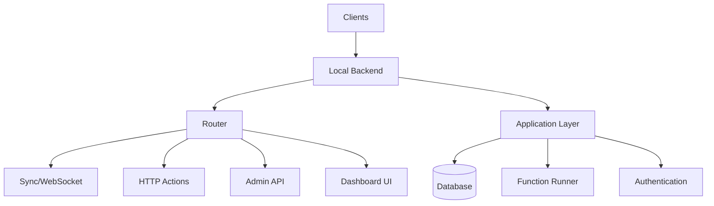

The local backend is the main application server that serves as the entry point and orchestrator for the entire Convex backend system. It handles all client connections, routing, and system coordination.

## Overview

Path: `crates/local_backend/`

The local backend crate provides:

- Main binary (`convex-local-backend`)
- HTTP and WebSocket server
- API routing and request handling
- Dashboard UI serving
- Admin endpoints
- Deployment state management

## Architecture



## Main binary

### Entry point

Path: `crates/local_backend/src/main.rs`

```rust
fn main() -> Result<(), MainError> {
    // Initialize logging and tracing
    let _guard = config_service();
    
    // Parse configuration
    let config = LocalConfig::parse();
    
    // Initialize Sentry for error tracking
    let sentry = sentry::init(...);
    
    // Create Tokio runtime
    let tokio = ProdRuntime::init_tokio()?;
    let runtime = ProdRuntime::new(&tokio);
    
    // Run the server
    runtime.block_on("main", run_server(runtime, config))
}
```

### Server initialization

```rust
async fn run_server(runtime: ProdRuntime, config: LocalConfig) -> Result<()> {
    // Connect to persistence layer
    let persistence = connect_persistence(&config).await?;
    
    // Initialize application
    let app = make_app(runtime.clone(), persistence, &config).await?;
    
    // Create router with all endpoints
    let router = router(app.clone(), &config).await?;
    
    // Start HTTP server
    let server = Server::bind(&addr)
        .serve(router.into_make_service());
    
    server.await?;
    Ok(())
}
```

## Configuration

### LocalConfig

Command-line configuration:

```rust
#[derive(Parser, Debug)]
pub struct LocalConfig {
    /// HTTP server port
    #[clap(long, default_value = "3210")]
    pub port: u16,
    
    /// Bind address
    #[clap(long, default_value = "0.0.0.0")]
    pub host: String,
    
    /// Persistence connection string
    #[clap(long, default_value = "sqlite://convex_local_backend.sqlite3")]
    pub persistence: String,
    
    /// Admin key for authentication
    #[clap(long, env = "CONVEX_ADMIN_KEY")]
    pub admin_key: String,
    
    /// Instance secret for encryption
    #[clap(long, env = "INSTANCE_SECRET")]
    pub instance_secret: String,
    
    /// Disable telemetry beacon
    #[clap(long, env = "DISABLE_BEACON")]
    pub disable_beacon: bool,
    
    /// Site URL for proxy
    #[clap(long)]
    pub site_url: Option<String>,
}
```

### Environment variables

Configuration via environment:

```bash
CONVEX_ADMIN_KEY=your-secret-admin-key
INSTANCE_SECRET=your-instance-secret
DISABLE_BEACON=true
CONVEX_SITE_PROXY=http://localhost:5173
```

## HTTP server

### Axum framework

The server uses Axum for routing:

```rust
use axum::{
    Router,
    routing::{get, post},
    middleware,
};

pub fn router(app: Application, config: &LocalConfig) -> Router {
    Router::new()
        // WebSocket sync endpoint
        .route("/sync", get(sync_handler))
        
        // HTTP functions
        .route("/http/:path", post(http_action_handler))
        
        // Admin API
        .route("/api/deploy", post(deploy_handler))
        .route("/api/query", post(query_handler))
        .route("/api/mutation", post(mutation_handler))
        
        // Dashboard UI
        .route("/", get(dashboard_index))
        .nest("/dashboard", dashboard_routes())
        
        // Middleware
        .layer(middleware::from_fn(auth_middleware))
        .layer(middleware::from_fn(cors_middleware))
        .layer(middleware::from_fn(metrics_middleware))
        
        // Shared state
        .with_state(app)
}
```

### Request handling

Typical request flow:

1. Request arrives at server
2. Middleware processes request (auth, CORS, etc.)
3. Router dispatches to appropriate handler
4. Handler calls application layer
5. Response is serialized and returned

## WebSocket sync

### Sync protocol

Path: `crates/local_backend/src/sync.rs`

Handles real-time synchronization:

```rust
pub async fn sync_handler(
    ws: WebSocketUpgrade,
    State(app): State<Application>,
) -> impl IntoResponse {
    ws.on_upgrade(|socket| handle_sync_connection(socket, app))
}

async fn handle_sync_connection(
    socket: WebSocket,
    app: Application,
) -> Result<()> {
    let (tx, rx) = socket.split();
    
    // Create sync session
    let session = app.sync_worker.new_session().await?;
    
    // Handle incoming messages
    let recv_task = tokio::spawn(async move {
        while let Some(msg) = rx.next().await {
            match msg? {
                Message::Text(text) => {
                    let request: SyncRequest = serde_json::from_str(&text)?;
                    session.handle_message(request).await?;
                }
                Message::Close(_) => break,
                _ => {},
            }
        }
        Ok(())
    });
    
    // Send outgoing messages
    let send_task = tokio::spawn(async move {
        while let Some(msg) = session.next_message().await {
            tx.send(Message::Text(serde_json::to_string(&msg)?)).await?;
        }
        Ok(())
    });
    
    // Wait for either task to complete
    tokio::select! {
        r = recv_task => r?,
        r = send_task => r?,
    }
}
```

See [Sync protocol component](/architecture/components/sync-protocol) for details.

## HTTP actions

### HTTP routing

Path: `crates/local_backend/src/http_actions.rs`

HTTP actions expose functions as HTTP endpoints:

```rust
pub async fn http_action_handler(
    Path(route_path): Path<String>,
    State(app): State<Application>,
    method: Method,
    headers: HeaderMap,
    body: Bytes,
) -> Result<Response<Body>> {
    // Parse route
    let route = HttpActionRoute::from_path(&route_path)?;
    
    // Build request context
    let request = HttpActionRequest {
        method: method.to_string(),
        url: route.url(),
        headers: headers.into(),
        body: body.to_vec(),
    };
    
    // Execute the action
    let response = app
        .execute_http_action(route.function_path(), request)
        .await?;
    
    // Convert to HTTP response
    Ok(Response::builder()
        .status(response.status)
        .body(Body::from(response.body))?)
}
```

### Route mapping

```rust
pub struct HttpActionRouteMapper {
    routes: HashMap<String, FunctionPath>,
}

impl HttpActionRouteMapper {
    pub fn map_route(&self, path: &str) -> Option<&FunctionPath> {
        self.routes.get(path)
    }
    
    pub fn register_route(&mut self, path: String, function: FunctionPath) {
        self.routes.insert(path, function);
    }
}
```

## Admin API

### Admin endpoints

Path: `crates/local_backend/src/admin.rs`

Admin operations require authentication:

```rust
// Deploy configuration
POST /api/deploy
{
  "functions": "...",
  "schema": "...",
  "adminKey": "..."
}

// Run query
POST /api/query
{
  "path": "myQuery",
  "args": {...},
  "adminKey": "..."
}

// Run mutation
POST /api/mutation
{
  "path": "myMutation",
  "args": {...},
  "adminKey": "..."
}

// Clear tables
POST /api/clear_tables
{
  "tableNames": ["table1", "table2"],
  "adminKey": "..."
}
```

### Authentication

Admin key verification:

```rust
pub fn verify_admin_key(
    headers: &HeaderMap,
    config: &LocalConfig,
) -> Result<()> {
    let auth_header = headers
        .get("Authorization")
        .ok_or(anyhow!("Missing Authorization header"))?;
    
    let token = auth_header
        .to_str()?
        .strip_prefix("Bearer ")
        .ok_or(anyhow!("Invalid Authorization header"))?;
    
    if token != config.admin_key {
        return Err(anyhow!("Invalid admin key"));
    }
    
    Ok(())
}
```

## Dashboard UI

### Dashboard serving

Path: `crates/local_backend/src/dashboard.rs`

Serves the self-hosted dashboard:

```rust
pub async fn dashboard_index() -> impl IntoResponse {
    // Serve dashboard HTML
    Html(include_str!("../dashboard/index.html"))
}

pub fn dashboard_routes() -> Router {
    Router::new()
        .route("/", get(dashboard_index))
        .route("/assets/*path", get(serve_asset))
        .route("/api/deployments", get(list_deployments))
        .route("/api/tables", get(list_tables))
        .route("/api/logs", get(stream_logs))
}
```

### Dashboard features

The dashboard provides:

- Deployment overview
- Table data browser
- Function logs viewer
- Schema editor
- Settings management

## Deployment management

### Deployment state

Path: `crates/local_backend/src/deployment_state.rs`

Tracks deployment configuration:

```rust
pub struct DeploymentState {
    /// Current deployed functions
    pub functions: BTreeMap<FunctionPath, CompiledFunction>,
    
    /// Active schema
    pub schema: Option<DatabaseSchema>,
    
    /// Environment variables
    pub environment_variables: BTreeMap<String, String>,
    
    /// HTTP routes
    pub http_routes: HttpActionRouteMapper,
}

impl DeploymentState {
    pub async fn deploy(
        &mut self,
        functions: BTreeMap<FunctionPath, CompiledFunction>,
        schema: Option<DatabaseSchema>,
    ) -> Result<()> {
        // Validate schema
        if let Some(schema) = &schema {
            schema.validate()?;
        }
        
        // Update functions
        self.functions = functions;
        self.schema = schema;
        
        // Rebuild HTTP routes
        self.rebuild_routes();
        
        Ok(())
    }
}
```

### Push deployment

Path: `crates/local_backend/src/deploy_config.rs`

Handles code push from CLI:

```rust
pub async fn handle_deploy(
    app: Application,
    request: DeployRequest,
) -> Result<DeployResponse> {
    // Verify admin key
    verify_admin_key(&request.admin_key)?;
    
    // Parse and compile functions
    let functions = compile_functions(&request.modules)?;
    
    // Parse schema
    let schema = request.schema
        .map(|s| parse_schema(&s))
        .transpose()?;
    
    // Deploy to application
    app.deploy(functions, schema).await?;
    
    Ok(DeployResponse {
        success: true,
        warnings: vec![],
    })
}
```

## Middleware

### Authentication middleware

```rust
pub async fn auth_middleware(
    req: Request<Body>,
    next: Next,
) -> Result<Response> {
    // Check if endpoint requires auth
    if requires_auth(req.uri().path()) {
        verify_admin_key(req.headers())?;
    }
    
    Ok(next.run(req).await)
}
```

### CORS middleware

```rust
pub async fn cors_middleware(
    req: Request<Body>,
    next: Next,
) -> Result<Response> {
    let mut response = next.run(req).await;
    
    response.headers_mut().insert(
        "Access-Control-Allow-Origin",
        "*".parse()?,
    );
    response.headers_mut().insert(
        "Access-Control-Allow-Methods",
        "GET, POST, OPTIONS".parse()?,
    );
    
    Ok(response)
}
```

### Metrics middleware

```rust
pub async fn metrics_middleware(
    req: Request<Body>,
    next: Next,
) -> Result<Response> {
    let start = Instant::now();
    let path = req.uri().path().to_string();
    let method = req.method().clone();
    
    let response = next.run(req).await;
    
    let duration = start.elapsed();
    record_request_metrics(&path, &method, response.status(), duration);
    
    Ok(response)
}
```

## Site proxy

### Development proxy

Path: `crates/local_backend/src/proxy.rs`

Proxy to frontend dev server:

```rust
pub async fn dev_site_proxy(
    req: Request<Body>,
    site_url: &str,
) -> Result<Response> {
    let client = reqwest::Client::new();
    
    // Forward request to dev server
    let url = format!("{}{}", site_url, req.uri().path());
    let response = client
        .request(req.method().clone(), &url)
        .headers(req.headers().clone())
        .body(req.into_body())
        .send()
        .await?;
    
    // Convert response
    Ok(response.into())
}
```

## Logging and monitoring

### Log streaming

Path: `crates/local_backend/src/logs.rs`

Stream function logs:

```rust
pub async fn stream_logs(
    Query(params): Query<LogQuery>,
    State(app): State<Application>,
) -> impl IntoResponse {
    let stream = app.log_stream(params.filters()).await;
    
    let body = Body::from_stream(stream.map(|log| {
        Ok::<_, anyhow::Error>(
            serde_json::to_string(&log)? + "\n"
        )
    }));
    
    Response::builder()
        .header("Content-Type", "application/x-ndjson")
        .body(body)
}
```

### Application metrics

Path: `crates/local_backend/src/app_metrics.rs`

Expose Prometheus metrics:

```rust
pub async fn metrics_handler(
    State(app): State<Application>,
) -> impl IntoResponse {
    let metrics = app.collect_metrics();
    let output = prometheus::TextEncoder::new()
        .encode_to_string(&metrics)?;
    
    Response::builder()
        .header("Content-Type", "text/plain")
        .body(output)
}
```

## Error handling

### Error responses

```rust
impl IntoResponse for AppError {
    fn into_response(self) -> Response {
        let (status, error_message) = match self {
            AppError::NotFound(msg) => (StatusCode::NOT_FOUND, msg),
            AppError::Unauthorized(msg) => (StatusCode::UNAUTHORIZED, msg),
            AppError::BadRequest(msg) => (StatusCode::BAD_REQUEST, msg),
            AppError::Internal(e) => {
                tracing::error!("Internal error: {}", e);
                (StatusCode::INTERNAL_SERVER_ERROR, "Internal server error".to_string())
            }
        };
        
        let body = Json(json!({
            "error": error_message,
        }));
        
        (status, body).into_response()
    }
}
```

## Graceful shutdown

### Shutdown handling

```rust
pub async fn run_server_with_shutdown(
    runtime: ProdRuntime,
    config: LocalConfig,
) -> Result<()> {
    let (shutdown_tx, shutdown_rx) = oneshot::channel();
    
    // Handle Ctrl+C
    tokio::spawn(async move {
        signal::ctrl_c().await.unwrap();
        shutdown_tx.send(()).ok();
    });
    
    // Run server
    let server = Server::bind(&addr)
        .serve(router.into_make_service())
        .with_graceful_shutdown(async {
            shutdown_rx.await.ok();
        });
    
    server.await?;
    Ok(())
}
```

## Testing

### Integration tests

```rust
#[tokio::test]
async fn test_query_endpoint() {
    let app = setup_test_app().await;
    
    let response = app
        .post("/api/query")
        .json(&json!({
            "path": "listTasks",
            "args": {},
            "adminKey": TEST_ADMIN_KEY,
        }))
        .send()
        .await
        .unwrap();
    
    assert_eq!(response.status(), StatusCode::OK);
}
```

## Next steps

- [Database engine component](/architecture/components/database-engine) - Core data layer
- [Function runner component](/architecture/components/function-runner) - UDF execution
- [Sync protocol component](/architecture/components/sync-protocol) - Real-time sync
- [Rust backend architecture](/architecture/rust-backend) - Overall architecture
