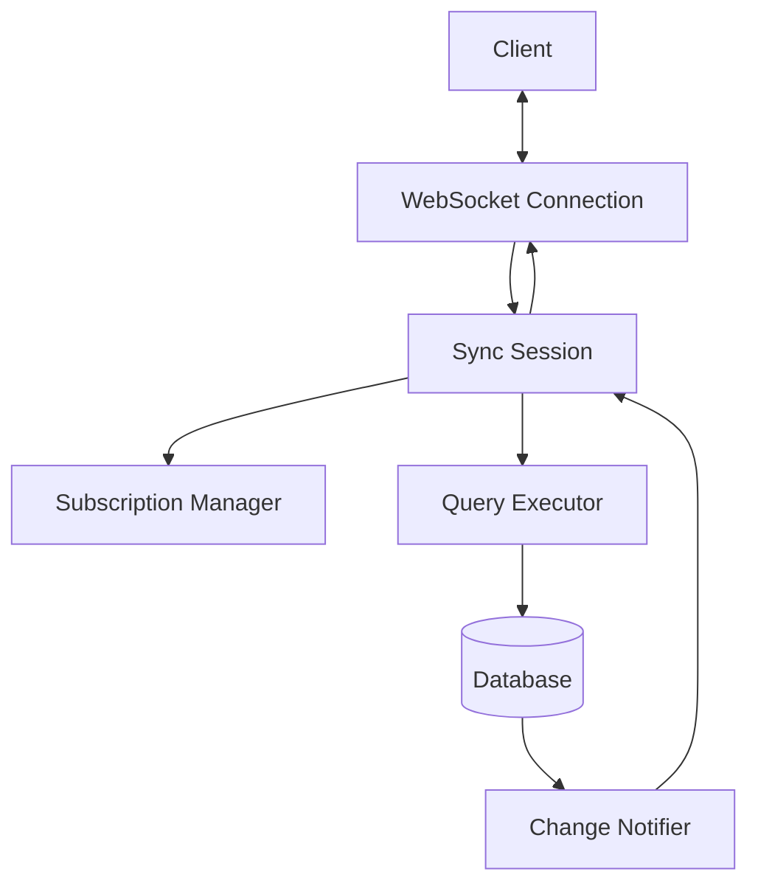

The sync protocol enables Convex's reactive subscriptions by maintaining WebSocket connections with clients and efficiently notifying them of data changes. This is the foundation of Convex's live-updating user interfaces.

## Overview

Path: `crates/sync/`

The sync component provides:

- WebSocket connection management
- Query subscription tracking
- Efficient change notification
- State synchronization between client and server
- Automatic reconnection handling

## Architecture



## Sync protocol flow

### Connection establishment

1. **Client connects**: Opens WebSocket to `/sync`
2. **Authentication**: Client sends auth token
3. **Session creation**: Server creates sync session
4. **Ready state**: Connection is ready for subscriptions

### Query subscription

1. **Client subscribes**: Sends query with subscription ID
2. **Query execution**: Server executes query in transaction
3. **Result returned**: Initial results sent to client
4. **Read set tracked**: Documents read are recorded
5. **Subscription registered**: Changes will notify this subscription

### Change notification

1. **Mutation commits**: Database transaction commits
2. **Affected subscriptions**: System identifies affected queries
3. **Notifications sent**: WebSocket messages sent to clients
4. **Client re-queries**: Client re-executes affected queries
5. **UI updates**: React components re-render with new data

## Protocol messages

### Client to server

```typescript
// Authenticate
{
  type: "Authenticate",
  token: string,
}

// Subscribe to query
{
  type: "Subscribe",
  queryId: number,
  udfPath: string,
  args: Record<string, any>,
}

// Unsubscribe
{
  type: "Unsubscribe",
  queryId: number,
}

// Execute mutation
{
  type: "Mutation",
  requestId: number,
  udfPath: string,
  args: Record<string, any>,
}

// Execute action  
{
  type: "Action",
  requestId: number,
  udfPath: string,
  args: Record<string, any>,
}
```

### Server to client

```typescript
// Query results
{
  type: "QueryUpdated",
  queryId: number,
  value: any,
  logLines: string[],
}

// Mutation result
{
  type: "MutationResponse",
  requestId: number,
  success: true,
  value: any,
}

// Error
{
  type: "Error",
  queryId?: number,
  requestId?: number,
  error: string,
}

// Transition (state change)
{
  type: "Transition",
  startVersion: number,
  endVersion: number,
  modifications: Modification[],
}
```

## Sync session implementation

### Session struct

```rust
pub struct SyncSession {
    /// Session ID
    id: SessionId,
    
    /// Authenticated identity
    identity: Option<Identity>,
    
    /// Active subscriptions
    subscriptions: BTreeMap<QueryId, Subscription>,
    
    /// WebSocket sender
    ws_tx: mpsc::Sender<Message>,
    
    /// Database handle
    database: Arc<Database>,
    
    /// Application handle
    application: Arc<Application>,
}

pub struct Subscription {
    query_id: QueryId,
    udf_path: FunctionPath,
    args: ConvexObject,
    read_set: ReadSet,
    last_result: Option<ConvexValue>,
}

impl SyncSession {
    pub async fn new(
        ws_tx: mpsc::Sender<Message>,
        database: Arc<Database>,
        application: Arc<Application>,
    ) -> Result<Self> {
        Ok(Self {
            id: SessionId::new(),
            identity: None,
            subscriptions: BTreeMap::new(),
            ws_tx,
            database,
            application,
        })
    }
}
```

### Handle subscription

```rust
impl SyncSession {
    pub async fn handle_subscribe(
        &mut self,
        query_id: QueryId,
        udf_path: FunctionPath,
        args: ConvexObject,
    ) -> Result<()> {
        // Execute query
        let (result, read_set) = self.application
            .execute_query_with_read_set(
                &udf_path,
                args.clone(),
                self.identity.clone(),
            )
            .await?;
        
        // Send initial result
        self.send_message(SyncMessage::QueryUpdated {
            query_id,
            value: result.clone(),
            log_lines: vec![],
        }).await?;
        
        // Store subscription
        let subscription = Subscription {
            query_id,
            udf_path,
            args,
            read_set,
            last_result: Some(result),
        };
        
        self.subscriptions.insert(query_id, subscription);
        
        Ok(())
    }
    
    pub async fn handle_unsubscribe(
        &mut self,
        query_id: QueryId,
    ) -> Result<()> {
        self.subscriptions.remove(&query_id);
        Ok(())
    }
}
```

### Handle mutation

```rust
impl SyncSession {
    pub async fn handle_mutation(
        &mut self,
        request_id: RequestId,
        udf_path: FunctionPath,
        args: ConvexObject,
    ) -> Result<()> {
        // Execute mutation
        let result = self.application
            .execute_mutation(
                &udf_path,
                args,
                self.identity.clone(),
            )
            .await;
        
        // Send response
        match result {
            Ok(value) => {
                self.send_message(SyncMessage::MutationResponse {
                    request_id,
                    success: true,
                    value,
                }).await?;
            }
            Err(e) => {
                self.send_message(SyncMessage::Error {
                    request_id: Some(request_id),
                    error: e.to_string(),
                }).await?;
            }
        }
        
        Ok(())
    }
}
```

## Change notification

### Subscription matching

```rust
pub struct SubscriptionManager {
    sessions: Arc<RwLock<HashMap<SessionId, SyncSession>>>,
}

impl SubscriptionManager {
    pub async fn notify_change(
        &self,
        writes: &WriteSet,
        timestamp: Timestamp,
    ) {
        let sessions = self.sessions.read().await;
        
        for session in sessions.values() {
            // Check which subscriptions are affected
            let affected = session
                .subscriptions
                .iter()
                .filter(|(_, sub)| writes.intersects(&sub.read_set))
                .map(|(id, _)| *id)
                .collect::<Vec<_>>();
            
            // Re-execute affected subscriptions
            for query_id in affected {
                if let Err(e) = session.refresh_subscription(query_id).await {
                    tracing::error!("Failed to refresh subscription: {}", e);
                }
            }
        }
    }
}
```

### Subscription refresh

```rust
impl SyncSession {
    async fn refresh_subscription(
        &mut self,
        query_id: QueryId,
    ) -> Result<()> {
        let subscription = self.subscriptions
            .get(&query_id)
            .ok_or_else(|| anyhow!("Subscription not found"))?;
        
        // Re-execute query
        let (new_result, new_read_set) = self.application
            .execute_query_with_read_set(
                &subscription.udf_path,
                subscription.args.clone(),
                self.identity.clone(),
            )
            .await?;
        
        // Check if result changed
        if Some(&new_result) != subscription.last_result.as_ref() {
            // Send update
            self.send_message(SyncMessage::QueryUpdated {
                query_id,
                value: new_result.clone(),
                log_lines: vec![],
            }).await?;
        }
        
        // Update subscription
        if let Some(sub) = self.subscriptions.get_mut(&query_id) {
            sub.read_set = new_read_set;
            sub.last_result = Some(new_result);
        }
        
        Ok(())
    }
}
```

## Optimizations

### Batching updates

Multiple changes are batched:

```rust
impl SyncSession {
    pub async fn flush_updates(&mut self) -> Result<()> {
        let updates = self.pending_updates.drain(..).collect::<Vec<_>>();
        
        if updates.is_empty() {
            return Ok(());
        }
        
        // Send as single message
        self.send_message(SyncMessage::Batch {
            messages: updates,
        }).await
    }
}
```

### Delta updates

Only send what changed:

```rust
impl SyncSession {
    fn compute_delta(
        &self,
        old_result: &ConvexValue,
        new_result: &ConvexValue,
    ) -> Option<Delta> {
        // Compute minimal diff between old and new
        // Return None if full update is smaller
        // ...
    }
}
```

### Subscription deduplication

Multiple identical queries share subscription:

```rust
impl SyncSession {
    fn deduplicate_subscription(
        &self,
        udf_path: &FunctionPath,
        args: &ConvexObject,
    ) -> Option<QueryId> {
        // Check if identical subscription exists
        self.subscriptions
            .iter()
            .find(|(_, sub)| {
                sub.udf_path == *udf_path && sub.args == *args
            })
            .map(|(id, _)| *id)
    }
}
```

## Client-side sync

The TypeScript client (`npm-packages/convex/`) implements the client side:

### Connection management

```typescript
class SyncConnection {
  private ws: WebSocket;
  private subscriptions = new Map<number, QuerySubscription>();
  private nextQueryId = 0;
  
  async connect(url: string): Promise<void> {
    this.ws = new WebSocket(url);
    
    this.ws.onmessage = (event) => {
      const message = JSON.parse(event.data);
      this.handleMessage(message);
    };
    
    this.ws.onclose = () => {
      // Reconnect logic
      this.reconnect();
    };
  }
  
  subscribe<T>(query: FunctionReference, args: any): Observable<T> {
    const queryId = this.nextQueryId++;
    
    // Send subscribe message
    this.send({
      type: "Subscribe",
      queryId,
      udfPath: query.path,
      args,
    });
    
    // Return observable that emits results
    return new Observable<T>((subscriber) => {
      this.subscriptions.set(queryId, {
        subscriber,
        query,
        args,
      });
      
      return () => {
        // Unsubscribe
        this.send({ type: "Unsubscribe", queryId });
        this.subscriptions.delete(queryId);
      };
    });
  }
  
  private handleMessage(message: SyncMessage): void {
    switch (message.type) {
      case "QueryUpdated": {
        const sub = this.subscriptions.get(message.queryId);
        sub?.subscriber.next(message.value);
        break;
      }
      // ...
    }
  }
}
```

## React integration

React hooks use the sync protocol:

```typescript
export function useQuery<T>(
  query: FunctionReference,
  args: any,
): T | undefined {
  const [result, setResult] = useState<T>();
  const convex = useConvex();
  
  useEffect(() => {
    // Subscribe to query
    const subscription = convex.subscribe(query, args);
    
    subscription.subscribe((value) => {
      setResult(value);
    });
    
    return () => subscription.unsubscribe();
  }, [query, JSON.stringify(args)]);
  
  return result;
}
```

## Performance characteristics

### Latency

- Initial query: Database query latency + network RTT
- Updates: ~10-100ms from mutation commit to UI update
- WebSocket overhead: ~1ms per message

### Scalability

- Connections per server: ~10,000 concurrent WebSockets
- Subscriptions per connection: Hundreds to thousands
- Update throughput: Thousands of notifications per second

### Efficiency

Optimizations reduce bandwidth:

- Incremental updates (only changed data)
- Message batching (multiple updates combined)
- Subscription deduplication (shared queries)
- Compression (WebSocket compression enabled)

## Testing

### Sync protocol tests

```rust
#[tokio::test]
async fn test_query_subscription() {
    let (session, mut rx) = create_test_session().await;
    
    // Subscribe to query
    session
        .handle_subscribe(1, "listTasks".parse()?, ConvexObject::empty())
        .await
        .unwrap();
    
    // Should receive initial result
    let msg = rx.recv().await.unwrap();
    assert!(matches!(msg, SyncMessage::QueryUpdated { query_id: 1, .. }));
}

#[tokio::test]
async fn test_change_notification() {
    let (session, mut rx) = create_test_session().await;
    
    // Subscribe
    session.handle_subscribe(1, "listTasks".parse()?, ConvexObject::empty()).await.unwrap();
    rx.recv().await; // Initial result
    
    // Insert document
    session.handle_mutation(1, "createTask".parse()?, args).await.unwrap();
    
    // Should receive update
    let msg = rx.recv().await.unwrap();
    assert!(matches!(msg, SyncMessage::QueryUpdated { query_id: 1, .. }));
}
```

## Next steps

- [Database engine component](/architecture/components/database-engine) - Subscription tracking
- [Function runner component](/architecture/components/function-runner) - Query execution
- [Local backend component](/architecture/components/local-backend) - WebSocket handling
- [System architecture overview](/architecture/overview) - Overall design
