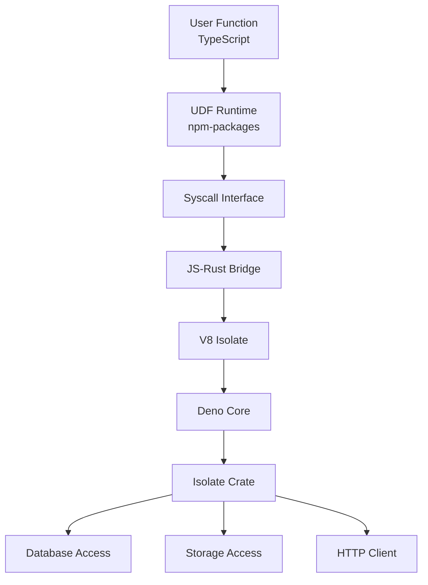

The isolate runtime is the sandboxed JavaScript execution environment where user-defined functions (UDFs) run. It provides a secure, performant bridge between Rust and JavaScript using Deno Core and V8.

## Overview

The `isolate` crate (`crates/isolate/`) implements:

- V8 isolate management and lifecycle
- JavaScript-to-Rust syscall bridge
- Built-in API implementations
- Module loading and resolution
- Security boundaries and resource limits
- Error handling and stack traces

## Architecture



## V8 isolate management

### Isolate lifecycle

Each function execution runs in a V8 isolate:

1. **Creation**: New isolate is created or retrieved from pool
2. **Initialization**: Runtime environment is set up
3. **Module loading**: User code and dependencies are loaded
4. **Execution**: Function runs with syscall access
5. **Cleanup**: Resources are released and isolate returned to pool

### Isolate pooling

To amortize initialization cost:

- Pool of pre-initialized isolates
- Reuse isolates across executions
- Eviction based on memory pressure
- Isolation between different deployments

### Memory management

V8 heap management:

- Configurable heap size limits
- Garbage collection tuning
- Memory pressure detection
- Out-of-memory handling

## UDF runtime integration

The UDF runtime (`npm-packages/udf-runtime/`) provides the JavaScript environment:

### Built-in APIs

Provides Convex-specific APIs:

```typescript
// Database operations
db.query("tableName")
db.insert("tableName", doc)
db.patch(id, updates)

// Storage operations
storage.getUrl(storageId)
storage.store(blob)

// Scheduling
scheduler.runAfter(delay, functionRef, args)
```

### Syscall interface

JavaScript calls Rust through syscalls:

```javascript
// JavaScript side
const result = Convex.syscall("db/query", args);

// Rust side receives and processes
fn handle_syscall(op: &str, args: Value) -> Result<Value>
```

### Environment setup

The runtime configures:

- Global objects and APIs
- Module resolution rules
- Import maps for dependencies
- Polyfills for Node.js compatibility

## Syscall implementation

### Syscall categories

#### Database syscalls

- `db/query`: Read documents from a table
- `db/insert`: Insert a new document
- `db/patch`: Update existing document
- `db/replace`: Replace entire document
- `db/delete`: Remove a document
- `db/get`: Get document by ID

#### Storage syscalls

- `storage/getUrl`: Get URL for stored file
- `storage/getMetadata`: Get file metadata
- `storage/store`: Store a file
- `storage/delete`: Delete a file

#### Scheduler syscalls

- `scheduler/runAfter`: Schedule delayed execution
- `scheduler/runAt`: Schedule at specific time
- `scheduler/cancel`: Cancel scheduled function

#### Action syscalls

- `fetch`: HTTP requests (actions only)
- `crypto`: Cryptographic operations
- `random`: Random number generation

### Syscall execution flow

1. JavaScript calls syscall function
2. Deno Core marshals arguments to Rust
3. Isolate runtime validates the syscall
4. Appropriate handler is invoked
5. Handler interacts with database/storage
6. Result is marshaled back to JavaScript
7. JavaScript receives the result

### Type conversion

Between JavaScript and Rust:

- **Primitives**: Direct mapping (number, string, boolean, null)
- **Objects**: Converted to `ConvexObject`
- **Arrays**: Converted to `ConvexArray`
- **Dates**: Converted to timestamp values
- **Functions**: Not directly transferable
- **Errors**: Special error object conversion

## Module system

### Module loading

Supports ES modules:

```typescript
// User code
import { query } from "./_generated/server";
import { someHelper } from "./helpers";

export default query(async (ctx) => {
  return await ctx.db.query("tasks").collect();
});
```

### Module resolution

1. Parse import specifier
2. Resolve to file path
3. Check module cache
4. Load and compile if needed
5. Execute module initialization
6. Return module exports

### Built-in modules

Provided by the runtime:

- `convex/server`: Server-side APIs
- `convex/values`: Type validators
- Node.js polyfills (limited set)

### Source maps

For TypeScript debugging:

- Source maps are preserved
- Stack traces map back to TypeScript
- Error messages reference original code

## Security and isolation

### Sandbox boundaries

Isolates are isolated from:

- File system access (no direct access)
- Network access (only through syscalls)
- Process spawning
- Native code execution
- Other isolates and deployments

### Resource limits

Enforced limits:

```rust
// Memory limit
max_heap_size: 512 MB

// Execution time
max_execution_time: 10 seconds (queries/mutations)
max_execution_time: 15 minutes (actions)

// Call stack depth
max_stack_depth: 1000 frames
```

### Syscall permissions

Different function types have different permissions:

- **Queries**: Read-only database access, no side effects
- **Mutations**: Read-write database access, deterministic
- **Actions**: Full network access, non-deterministic operations
- **HTTP actions**: HTTP request/response handling

## Error handling

### JavaScript errors

Errors in user code are caught:

```typescript
try {
  // User function execution
  const result = await userFunction(ctx, args);
  return result;
} catch (error) {
  // Error is captured with stack trace
  return formatError(error);
}
```

### Stack traces

Stack trace processing:

1. V8 captures raw stack trace
2. Source maps are applied
3. Internal frames are filtered
4. User-friendly stack trace is generated
5. Error is returned to client

### System errors

Rust-side errors:

- Out of memory
- Execution timeout
- Syscall errors
- Invalid arguments

These are converted to JavaScript errors with appropriate messages.

## Performance optimization

### Compilation caching

Compiled code is cached:

- JavaScript is compiled to V8 bytecode
- Bytecode is cached by module hash
- Warm start for repeated executions
- Cache eviction based on LRU

### Snapshot support

V8 snapshots for fast startup:

- Runtime environment pre-initialized
- Snapshot saved to disk
- New isolates restore from snapshot
- Reduces initialization time

### JIT optimization

V8's JIT compiler:

- Hot functions are optimized
- Inline caching for property access
- Type feedback for optimization
- Deoptimization when assumptions break

## Integration with function runner

The function runner coordinates isolate usage:

### Execution flow

1. Function runner receives request
2. Acquires isolate from pool
3. Sets up execution context
4. Invokes function in isolate
5. Collects results or errors
6. Returns isolate to pool

See [Function runner component](/architecture/components/function-runner) for details.

### Transaction coordination

For queries and mutations:

- Database transaction is started before execution
- Syscalls operate within transaction
- Transaction commits after successful execution
- Rollback on errors

### Streaming results

For large result sets:

- Results stream back to client
- Backpressure handling
- Chunked processing

## Deno Core integration

### Why Deno Core

Deno Core provides:

- Rust-to-V8 bindings
- Module system implementation
- Promise/async integration
- Op (syscall) infrastructure
- Resource management

### Op interface

Deno's op system for syscalls:

```rust
#[op]
fn op_db_query(state: &mut OpState, args: QueryArgs) -> Result<Vec<Value>> {
    // Implementation
}
```

### Extension system

Convex defines extensions:

```rust
extension!(
    convex_runtime,
    ops = [
        op_db_query,
        op_db_insert,
        op_storage_get,
        // ...
    ]
);
```

## Testing

### Unit tests

Test individual syscalls:

```rust
#[tokio::test]
async fn test_db_query_syscall() {
    let isolate = setup_test_isolate().await;
    let result = isolate.execute_query(...).await;
    assert!(result.is_ok());
}
```

### Integration tests

Test full function execution:

```typescript
test("query execution", async () => {
  const result = await ctx.runQuery("myQuery", {});
  expect(result).toEqual(expectedData);
});
```

### Property-based tests

Test syscall robustness:

```rust
proptest! {
    #[test]
    fn test_value_conversion(v: ConvexValue) {
        let js_val = to_js_value(v.clone());
        let rust_val = from_js_value(js_val);
        assert_eq!(v, rust_val);
    }
}
```

## Debugging and observability

### Logging

Function execution logging:

- Console.log statements captured
- Structured log format
- Streaming to dashboard
- Log level filtering

### Tracing

Distributed tracing:

- Syscall tracing
- Execution time tracking
- Span correlation
- Performance profiling

### Metrics

Isolate metrics:

- Execution time histograms
- Memory usage tracking
- Error rates
- Syscall counts

## Known limitations

### Node.js compatibility

Limited Node.js API support:

- No native modules
- Subset of standard library
- Some APIs not available in queries/mutations

### Memory constraints

Heap size limits may affect:

- Large data processing
- Deep recursion
- Memory-intensive operations

### Execution time limits

Long-running operations:

- Queries/mutations: 10 second limit
- Actions: 15 minute limit
- Use scheduling for longer tasks

## Next steps

- [Function runner component](/architecture/components/function-runner) - Orchestration layer
- [Database engine component](/architecture/components/database-engine) - Database integration
- [Rust backend architecture](/architecture/rust-backend) - Overall system architecture
