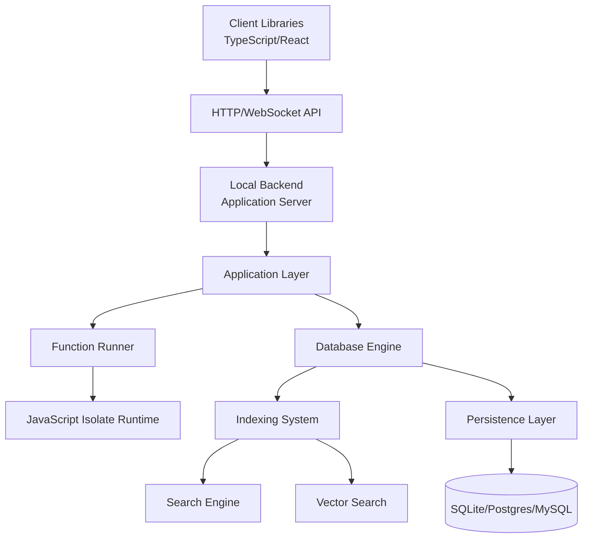

Convex is an open-source reactive database designed to make life easy for web app developers. The system provides a database, a place to write server functions, and client libraries to build and scale dynamic live-updating apps.

## Architecture layers

The Convex backend is built with a multi-layered architecture that separates concerns and enables scalability:

## Core components

### Local backend

The `local_backend` crate is the main application server that serves as the edge for the Convex system. It:

- Handles HTTP and WebSocket connections from clients
- Manages authentication and authorization
- Routes requests to appropriate handlers
- Provides the dashboard UI and admin endpoints
- Orchestrates the entire backend stack

See [Local backend component](/architecture/components/local-backend) for details.

### Application layer

The `application` crate sits on top of the Runtime and provides:

- High-level business logic orchestration
- Deployment and configuration management
- Schema validation and inference
- Export/import functionality
- User-defined function (UDF) coordination

### Database engine

The `database` crate implements the core reactive database with:

- Transactional ACID guarantees with strong consistency
- Table and schema registry
- Query execution with snapshot isolation
- Subscription management for reactivity
- Index management and coordination

See [Database engine component](/architecture/components/database-engine) for details.

### Function runner

The `function_runner` crate executes user-defined functions (queries, mutations, actions) written in TypeScript/JavaScript. It:

- Manages function execution lifecycle
- Provides caching for function compilation
- Coordinates with the isolate runtime
- Handles function scheduling and concurrency

See [Function runner component](/architecture/components/function-runner) for details.

### JavaScript isolate runtime

The `isolate` crate provides a sandboxed JavaScript execution environment using Deno Core:

- Executes user-defined functions in V8 isolates
- Provides built-in APIs and syscalls
- Enforces security boundaries and resource limits
- Handles module resolution and loading

See [Isolate runtime architecture](/architecture/isolate-runtime) for details.

### Indexing system

The `indexing` crate manages database indexes:

- B-tree indexes for range queries
- Text search indexes using Tantivy
- Vector indexes for similarity search
- Automatic index maintenance and updates

See [Indexing system](/architecture/indexing) for details.

### Storage and persistence

The `storage` crate provides persistence abstraction:

- Pluggable storage backends (SQLite, Postgres, MySQL)
- Transaction log management
- Snapshot isolation support
- File storage integration

See [Data persistence layer](/architecture/persistence) for details.

## Technology stack

### Rust backend

The backend is written in Rust and organized into 67 crates:

- **Runtime**: Async runtime built on Tokio
- **Database**: Core database engine with transaction support
- **Indexing**: Index management and query optimization
- **Search**: Full-text and vector search engines
- **Storage**: Persistence layer abstraction
- **Isolate**: JavaScript runtime using Deno Core
- **Networking**: HTTP/WebSocket servers using Axum

See [Rust backend architecture](/architecture/rust-backend) for details.

### TypeScript SDK

The TypeScript ecosystem includes:

- **Client libraries**: React hooks and vanilla JS clients
- **UDF runtime**: JavaScript environment setup for functions
- **CLI**: Command-line tool for deployment and management
- **Dashboard**: Web UI for deployment management
- **System UDFs**: Built-in functions used by the system

The UDF runtime (`npm-packages/udf-runtime/`) sets up the JavaScript environment that executes inside the Rust isolate runtime.

## Data flow

### Query execution

1. Client sends query request via WebSocket or HTTP
2. Local backend authenticates and routes the request
3. Application layer validates the query
4. Function runner prepares the execution context
5. Isolate runtime executes the query function
6. Database engine reads data using indexes
7. Results stream back to the client
8. Subscription is registered for reactive updates

### Mutation execution

1. Client sends mutation request
2. Request is authenticated and validated
3. Function runner starts a transaction
4. Isolate executes the mutation function
5. Database applies writes within the transaction
6. Transaction commits atomically
7. Indexes are updated asynchronously
8. Subscribers are notified of changes

### Reactive subscriptions

Convex's reactivity is implemented through:

- Read set tracking during query execution
- Subscription registration in the database
- Change detection when mutations commit
- Efficient notification of affected subscriptions
- Automatic re-execution of queries on the client

See [Sync protocol component](/architecture/components/sync-protocol) for details.

## Deployment models

### Cloud platform

The hosted cloud platform runs the same open-source backend with additional:

- Multi-tenancy and isolation
- Distributed deployment across regions
- Managed infrastructure and scaling
- Monitoring and observability

### Self-hosted

Self-hosted deployments support:

- Docker container deployment
- Binary deployment on Linux/Mac
- SQLite, Postgres, or MySQL for persistence
- Integration with cloud providers (Fly.io, Vercel, etc.)

## Key design principles

### Strong consistency

All operations provide ACID guarantees with snapshot isolation. There are no eventual consistency compromises.

### Reactivity by default

Queries automatically subscribe to changes and re-execute when data updates, enabling live-updating UIs without additional code.

### Type safety

The system is built with TypeScript on the client and Rust on the backend, providing end-to-end type safety.

### Developer experience

The architecture prioritizes developer productivity:

- Write business logic in pure TypeScript
- No need to manage API endpoints
- Automatic schema inference
- Hot reload during development

## Performance characteristics

### Scalability

- Horizontal scaling through stateless application servers
- Efficient index structures for fast queries
- Async I/O throughout the stack
- Connection pooling and caching

### Latency

- Sub-millisecond query execution for indexed reads
- WebSocket connections for low-latency updates
- Streaming responses for large result sets
- Client-side caching and optimistic updates

## Security

### Isolation

- V8 isolates provide sandboxed execution
- Resource limits prevent runaway functions
- Row-level security through auth rules
- Network isolation for user functions

### Authentication

- Multiple auth providers supported
- JWT-based authentication
- Admin key for CLI and dashboard
- Per-deployment security policies

## Next steps

- [Rust backend architecture](/architecture/rust-backend) - Detailed look at the Rust codebase
- [Database engine](/architecture/components/database-engine) - Core database implementation
- [Isolate runtime](/architecture/isolate-runtime) - JavaScript execution environment
- [Indexing system](/architecture/indexing) - Index types and optimization
