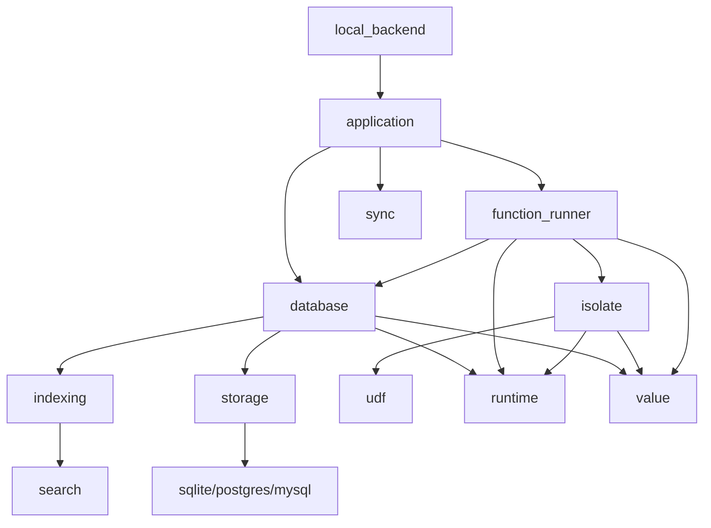

The Convex backend is implemented in Rust and organized as a workspace with 67 crates. This modular architecture enables clean separation of concerns, testability, and reusability.

## Crate organization

The `crates/` directory contains all Rust code, with each crate serving a specific purpose in the system.

### Main binary

#### local_backend

- **Path**: `crates/local_backend/`
- **Binary**: `convex-local-backend`
- **Purpose**: Main application server and entry point

This is the top-level application that:

- Starts the HTTP/WebSocket server using Axum
- Initializes the runtime and all subsystems
- Provides routing for API endpoints
- Serves the dashboard UI
- Handles admin operations
- Manages deployment state

Key dependencies:
```toml
application, database, isolate, runtime, storage,
function_runner, search, sync, authentication
```

See [Local backend component](/architecture/components/local-backend) for details.

## Core infrastructure crates

### runtime

- **Path**: `crates/runtime/`
- **Purpose**: Async runtime abstraction layer

Provides the Runtime trait that abstracts over Tokio for:

- Task spawning and scheduling
- Timers and timeouts
- Thread pool management
- Testing with simulated time

The production runtime (`ProdRuntime`) wraps Tokio, while testing uses a simulated runtime for deterministic tests.

### common

- **Path**: `crates/common/`
- **Purpose**: Shared utilities and primitives

Contains:

- Error handling utilities
- Logging and tracing setup
- Knobs (configuration constants)
- HTTP client abstractions
- Common traits and types

### errors

- **Path**: `crates/errors/`
- **Purpose**: Error type definitions

Defines error types used throughout the system with proper categorization for:

- User errors (invalid input, etc.)
- System errors (internal failures)
- Transient errors (retryable failures)

### metrics

- **Path**: `crates/metrics/`
- **Purpose**: Observability and monitoring

Provides:

- Prometheus metrics integration
- Custom metric types (counters, histograms, gauges)
- Performance tracking
- Resource usage monitoring

## Data layer crates

### database

- **Path**: `crates/database/`
- **Purpose**: Core database engine

The heart of Convex's data management:

- Transaction implementation with ACID guarantees
- Table and schema registry
- Snapshot isolation and MVCC
- Query execution engine
- Subscription tracking for reactivity
- Index coordination
- Read and write set tracking

Key modules:

- `transaction.rs`: Transaction implementation
- `database.rs`: Main database struct
- `table_registry.rs`: Table metadata management
- `schema_registry.rs`: Schema validation
- `subscription.rs`: Reactive subscription handling
- `query.rs`: Query execution

See [Database engine component](/architecture/components/database-engine) for details.

### storage

- **Path**: `crates/storage/`
- **Purpose**: Persistence abstraction

Abstracts over different storage backends:

- Trait-based storage interface
- Streaming read/write operations
- Transaction log support
- Snapshot management

See [Data persistence layer](/architecture/persistence) for details.

### value

- **Path**: `crates/value/`
- **Purpose**: Core data type system

Defines Convex's value types:

- `ConvexValue`: Enum of all supported types
- `ConvexObject`: Map of field names to values
- `ConvexArray`: Array of values
- Document IDs and table names
- Field paths and names
- Serialization/deserialization
- Size tracking for resource limits

### model

- **Path**: `crates/model/`
- **Purpose**: Domain model and business logic

Provides high-level models for:

- Tables and documents
- Indexes and queries
- Schemas and validators
- Deployments and environments
- User-defined functions
- Configuration structures

## Indexing and search crates

### indexing

- **Path**: `crates/indexing/`
- **Purpose**: Index abstraction and implementation

Core indexing infrastructure:

- B-tree index structures
- Index registry and metadata
- Range query support
- Index maintenance coordination

See [Indexing system](/architecture/indexing) for details.

### search

- **Path**: `crates/search/`
- **Purpose**: Full-text and vector search

Powered by Tantivy and Qdrant:

- Text search indexes
- Vector similarity search
- Search index building and maintenance
- Query parsing and execution

### text_search

- **Path**: `crates/text_search/`
- **Purpose**: Text search specifics

Text search features:

- Tokenization and stemming
- BM25 scoring
- Fuzzy matching
- Prefix search

### vector

- **Path**: `crates/vector/`
- **Purpose**: Vector operations and types

Vector search support:

- Vector type definitions
- Distance metrics (cosine, euclidean, dot product)
- Vector validation
- Integration with Qdrant segment library

## Function execution crates

### isolate

- **Path**: `crates/isolate/`
- **Purpose**: JavaScript isolate runtime

JavaScript execution using Deno Core:

- V8 isolate management
- JavaScript to Rust bridge
- Syscall implementation
- Module loading and resolution
- Resource limits and timeouts
- Built-in API implementations

See [Isolate runtime architecture](/architecture/isolate-runtime) for details.

### function_runner

- **Path**: `crates/function_runner/`
- **Purpose**: Function execution orchestration

Manages UDF execution:

- Function scheduling and queuing
- Compilation caching
- Execution context setup
- Transaction coordination
- Result collection

See [Function runner component](/architecture/components/function-runner) for details.

### udf

- **Path**: `crates/udf/`
- **Purpose**: UDF types and utilities

Defines:

- Function types (query, mutation, action, http)
- Function arguments and return types
- Validation and conversion
- Path resolution

### node_executor

- **Path**: `crates/node_executor/`
- **Purpose**: Node.js execution for actions

Executes actions in Node.js:

- Process management
- IPC communication
- Streaming responses
- Error handling

## Application layer crates

### application

- **Path**: `crates/application/`
- **Purpose**: High-level application logic

Orchestrates the entire system:

- Deployment management
- Configuration handling
- Schema validation and inference
- Export/import operations
- Push deployments
- Component isolation

Depends on most other crates to coordinate functionality.

### authentication

- **Path**: `crates/authentication/`
- **Purpose**: Authentication and authorization

Auth features:

- JWT token validation
- OAuth integration
- Admin key verification
- Identity management
- Session handling

### sync

- **Path**: `crates/sync/`
- **Purpose**: Client synchronization protocol

Implements the sync protocol for reactive updates:

- WebSocket connection management
- Query subscription tracking
- Change notification
- State synchronization

See [Sync protocol component](/architecture/components/sync-protocol) for details.

## Persistence backend crates

### sqlite

- **Path**: `crates/sqlite/`
- **Purpose**: SQLite storage backend

Implementation using rusqlite:

- Transaction support
- Efficient querying
- Local file storage
- Default for self-hosted deployments

### postgres

- **Path**: `crates/postgres/`
- **Purpose**: PostgreSQL storage backend

Implementation using tokio-postgres:

- Connection pooling
- Async operations
- Scalable storage

### mysql

- **Path**: `crates/mysql/`
- **Purpose**: MySQL storage backend

Implementation using mysql_async:

- Compatible with MySQL and MariaDB
- Connection management
- Async query execution

## Utility crates

### pb and pb_build

- **Paths**: `crates/pb/`, `crates/pb_build/`
- **Purpose**: Protocol Buffers support

For efficient serialization:

- Protobuf definitions
- Code generation
- Wire format compatibility

### keybroker

- **Path**: `crates/keybroker/`
- **Purpose**: Encryption key management

Manages encryption:

- Key derivation
- Key rotation
- Secure storage

### file_storage

- **Path**: `crates/file_storage/`
- **Purpose**: File upload and storage

Handles:

- File metadata
- Content-addressed storage
- Upload/download operations
- Integration with S3

### events

- **Path**: `crates/events/`
- **Purpose**: Event tracking and analytics

Tracks:

- System events
- Usage metrics
- Audit logs

### usage_tracking

- **Path**: `crates/usage_tracking/`
- **Purpose**: Resource usage monitoring

Monitors:

- Bandwidth usage
- Storage consumption
- Function execution time
- Database operations

## Dependency architecture

### Workspace dependencies

The `Cargo.toml` at the root defines all dependencies with version pinning:

```toml
[workspace.dependencies]
database = { path = "crates/database" }
storage = { path = "crates/storage" }
runtime = { path = "crates/runtime" }
# ... 67 crates total
```

### Key external dependencies

- **tokio**: Async runtime foundation
- **axum**: HTTP server framework
- **deno_core**: V8 JavaScript runtime
- **tantivy**: Full-text search engine
- **serde/serde_json**: Serialization
- **anyhow**: Error handling
- **tracing**: Structured logging

### Dependency graph highlights



## Build system

### Workspace setup

The workspace uses Cargo's workspace feature:

```toml
[workspace]
members = [ "crates/*", "crates/convex/sync_types" ]
resolver = "2"
```

### Build profiles

- **dev**: Fast compilation, debug symbols
- **release**: Full optimization, panic=abort
- **slim-release**: Stripped debug info for smaller binaries

### Testing

Each crate has its own tests:

```bash
cargo test -p database
cargo test -p isolate
```

The `testing` feature flag enables test utilities:

```toml
[features]
testing = [
    "common/testing",
    "database/testing",
    # ...
]
```

## Development workflow

Building and running:

```bash
# Format code
just format-rust

# Lint
just lint-rust

# Build specific crate
cargo build -p local_backend

# Run tests
cargo test -p database

# Run the backend
just run-local-backend
```

## Key architectural patterns

### Trait-based abstraction

Core abstractions use traits:

- `Runtime`: Async runtime operations
- `Persistence`: Storage backend operations
- `Transaction`: Database transaction interface

### Async/await throughout

All I/O operations are async:

- Database queries
- HTTP requests
- File operations
- Function execution

### Strong typing

Rust's type system enforces:

- Compile-time correctness
- Memory safety
- Thread safety
- Error handling

### Testing culture

Extensive testing:

- Unit tests in each module
- Integration tests in `tests/`
- Property-based testing with proptest
- Benchmark tests for performance

## Performance considerations

### Async I/O

Tokio provides:

- Efficient task scheduling
- Non-blocking I/O
- Work-stealing scheduler

### Memory management

- Zero-copy operations where possible
- Careful use of cloning
- Reference counting for shared data
- Bump allocation for transactions

### Concurrency

- Lock-free data structures where possible
- Minimal lock contention
- Async operations avoid blocking
- Isolated execution contexts

## Next steps

- [Database engine component](/architecture/components/database-engine)
- [Isolate runtime architecture](/architecture/isolate-runtime)
- [Data persistence layer](/architecture/persistence)
- [Local backend component](/architecture/components/local-backend)
